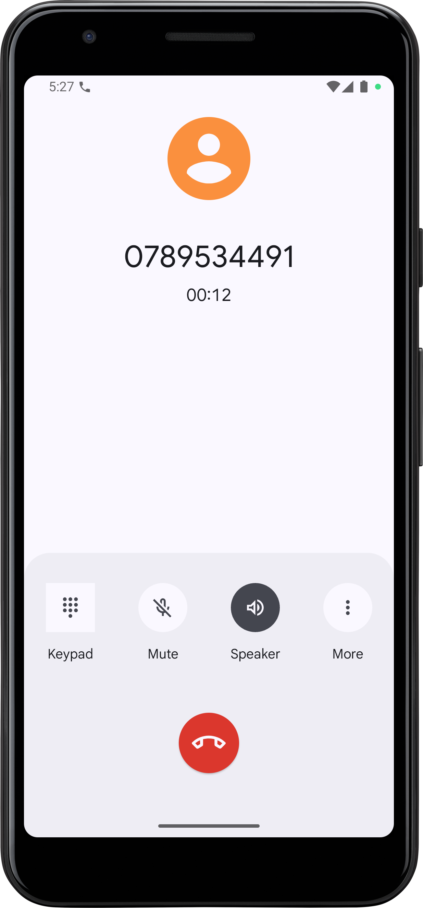

# Employee Management System - Android Application

## Project Overview
A multi-activity Android application for managing employee records with features including employee registration, department management, and employee details viewing. The app demonstrates the use of Intents (both explicit and implicit), ListViews, and background services.

## Screenshots

### Employee List


### Employee Details


### Dialer Integration


## Features
- **Employee List View**: Display all registered employees in a scrollable ListView
- **Employee Registration**: Add new employees with complete details
- **Department Management**: Browse employees by department
- **Employee Details**: View detailed employee information with interactive phone and email fields
- **Implicit Intents**: Click-to-call and click-to-email functionality
- **Background Service**: Music player service that runs in the background

## Activities and Their Purpose

### 1. EmployeeListActivity (Main/Launcher Activity)
- **Purpose**: Displays a list of all registered employees
- **Features**:
  - ListView showing Employee ID and Name
  - Navigation buttons to Registration and Departments
  - Button to stop background music service
  - Click on any employee to view details
- **Intent Type**: Explicit Intent to EmployeeDetailActivity

### 2. EmployeeRegistrationActivity
- **Purpose**: Register new employees
- **Features**:
  - Form fields for Employee ID, Name, Gender, Email, Phone, Department
  - Data validation
  - Saves employee to EmployeeManager singleton
- **Intent Type**: Launched via Explicit Intent from EmployeeListActivity

### 3. DepartmentActivity
- **Purpose**: Display list of departments
- **Features**:
  - ListView of available departments (IT, HR, Finance, Marketing, Operations)
  - Click on department to view employees in that department
- **Intent Type**: Explicit Intent to EmployeeInDepartmentDetailActivity

### 4. EmployeeInDepartmentDetailActivity
- **Purpose**: Show employees filtered by department
- **Features**:
  - Displays department name
  - ListView of employees in selected department
  - Click on employee to view details
- **Intent Type**: Explicit Intent to EmployeeDetailActivity

### 5. EmployeeDetailActivity
- **Purpose**: Display complete employee information
- **Features**:
  - Shows all employee details (ID, Name, Gender, Email, Phone, Department)
  - **Clickable Phone TextView**: Opens dialer with phone number pre-filled (Implicit Intent - ACTION_DIAL)
  - **Clickable Email TextView**: Opens email app with email address pre-filled (Implicit Intent - ACTION_SENDTO)
- **Intent Type**: Receives data via Explicit Intent from multiple activities

## Background Service

### MusicPlayerService
- **Purpose**: Demonstrates background service that continues running while navigating between activities
- **Features**:
  - Starts automatically when app launches
  - Runs independently of activity lifecycle
  - Can be stopped via button in EmployeeListActivity
  - Shows Toast notifications on start/stop

## Data Flow Between Activities

### Flow Diagram:
```
EmployeeListActivity (Main)
    ├─> EmployeeRegistrationActivity
    │   └─> Saves to EmployeeManager
    │       └─> Returns to EmployeeListActivity (refreshes list)
    │
    ├─> DepartmentActivity
    │   └─> EmployeeInDepartmentDetailActivity
    │       └─> EmployeeDetailActivity
    │           ├─> Phone Click → Dialer (Implicit Intent)
    │           └─> Email Click → Email App (Implicit Intent)
    │
    └─> EmployeeDetailActivity (direct from list click)
        ├─> Phone Click → Dialer (Implicit Intent)
        └─> Email Click → Email App (Implicit Intent)
```

### Data Passing Mechanism:
1. **Employee Object**: Passed as Serializable via Intent extras
   ```java
   intent.putExtra("employee", employee);
   Employee emp = (Employee) getIntent().getSerializableExtra("employee");
   ```

2. **Department String**: Passed as String extra
   ```java
   intent.putExtra("department", department);
   String dept = getIntent().getStringExtra("department");
   ```

3. **Singleton Pattern**: EmployeeManager maintains a single instance of employee list accessible across all activities

## Intents Used

### Explicit Intents (Activity Navigation):
1. EmployeeListActivity → EmployeeRegistrationActivity
2. EmployeeListActivity → DepartmentActivity
3. EmployeeListActivity → EmployeeDetailActivity
4. DepartmentActivity → EmployeeInDepartmentDetailActivity
5. EmployeeInDepartmentDetailActivity → EmployeeDetailActivity

### Implicit Intents (System Actions):
1. **ACTION_DIAL**: Opens phone dialer
   ```java
   Intent dialIntent = new Intent(Intent.ACTION_DIAL);
   dialIntent.setData(Uri.parse("tel:" + phoneNumber));
   ```

2. **ACTION_SENDTO**: Opens email client
   ```java
   Intent emailIntent = new Intent(Intent.ACTION_SENDTO);
   emailIntent.setData(Uri.parse("mailto:" + email));
   ```

## Technical Implementation

### Key Components:
- **Employee.java**: Data model implementing Serializable
- **EmployeeManager.java**: Singleton pattern for data management
- **MusicPlayerService.java**: Background service using MediaPlayer
- **5 Activities**: Complete navigation flow
- **5 XML Layouts**: UI for each activity

### Permissions Required:
- `CALL_PHONE`: For phone dialing functionality
- `INTERNET`: For email functionality

### Android Components Used:
- ListView with ArrayAdapter
- Intent (Explicit and Implicit)
- Service (Background)
- Serializable for data passing
- RadioGroup for gender selection
- Toast for user feedback

## How to Run

1. Clone the repository from GitLab
2. Open project in Android Studio
3. Sync Gradle files
4. Run on emulator or physical device (API 21+)
5. Grant phone permission when prompted

## Sample Data
The app comes pre-loaded with 3 sample employees:
- EMP001 - John Doe (IT)
- EMP002 - Jane Smith (HR)
- EMP003 - Bob Johnson (Finance)

## Testing the Features

### ListView Implementation:
- Open app to see employee list
- Scroll through employees
- Click any employee to view details

### Explicit Intents:
- Click "Register" button to add new employee
- Click "Departments" to browse by department
- Click any employee in list to view details

### Implicit Intents:
- In Employee Detail screen, click phone number to open dialer
- Click email address to open email app

### Background Service:
- Service starts automatically on app launch
- Navigate between activities (service continues running)
- Click "Stop Background Music" to stop service

## Project Structure
```
app/
├── src/main/
│   ├── java/com/auca/employeemanagement/
│   │   ├── Employee.java
│   │   ├── EmployeeManager.java
│   │   ├── EmployeeListActivity.java
│   │   ├── EmployeeDetailActivity.java
│   │   ├── EmployeeRegistrationActivity.java
│   │   ├── DepartmentActivity.java
│   │   ├── EmployeeInDepartmentDetailActivity.java
│   │   └── MusicPlayerService.java
│   ├── res/
│   │   ├── layout/
│   │   │   ├── activity_employee_list.xml
│   │   │   ├── activity_employee_detail.xml
│   │   │   ├── activity_employee_registration.xml
│   │   │   ├── activity_department.xml
│   │   │   └── activity_employee_in_department.xml
│   │   └── values/
│   │       ├── strings.xml
│   │       ├── colors.xml
│   │       └── themes.xml
│   └── AndroidManifest.xml
└── build.gradle
```

## Development Environment
- **IDE**: Android Studio
- **Language**: Java
- **Min SDK**: API 21 (Android 5.0)
- **Target SDK**: API 33 (Android 13)
- **Build Tool**: Gradle

## Future Enhancements
- SQLite database for persistent storage
- Search and filter functionality
- Employee photo upload
- Edit and delete employee records
- Department statistics and analytics
- Export employee data to CSV/PDF

## Author
AUCA Student - Mobile Programming Assignment III

## License
Educational Project - AUCA 2024
